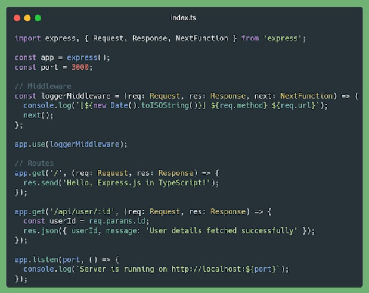
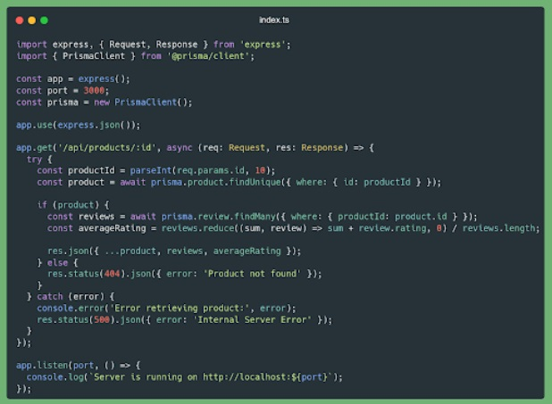
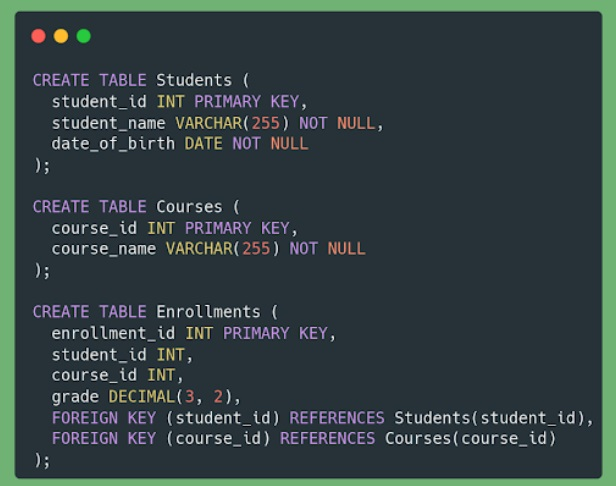
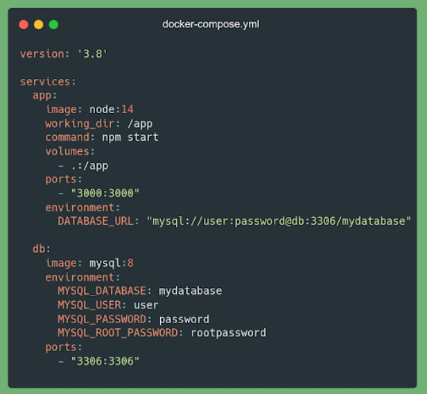

1. What is the role of npm in Node JS application development?
a. Handling HTTP Response
b. Handling HTTP Request
x. Managing Dependencies and Packages
d. A & B are Correct

2. How do you create a GET route endpoint in Express JS following proper REST conventions? (ex: for fetching a collection of products).
a. app.post('/products, callback)
b. app.get('/product, callback)
c. app.get('/get-product', callback)
x. app.get('/products', callback)

3. What is the difference between PUT and POST in the context of REST API?
a. PUT is used to create new data, while POST is used to update data.
x. PUT is used to update data, while POST is used to create new data.
c. PUT and POST can both be used to create new data
d. PUT and POST can both be used to update data.

4. How do you configure middleware in Express JS? assuming app is the variable declared for express.
x. app.use(middlewareFunction)
b. middlewareFunction.configure(app)
c. middlewareFunction.use(app)
d. app.configure(middlewareFunction)

5. What is middleware in Express JS and how can you implement it to validate input data before saving it to the database?
a. Middleware is used only to connect Express JS application with the database server.
b. Middleware can only be used for user session management.
x. Middleware is a function that can modify the request or response object.
d. Middleware is the standard method for managing routes in Express JS

6. The following is not for handling user authentication in REST API developemnt:
a. Basic Authentication
b. JWT (Json Web Token)
x. OAuth 4.0
d. All Answer are Correct

7. The following is not used for implementing automated testing for REST API built with Node JS
x. Unit testing with CMS and Chai
b. Integration test with Supertest
c. Unit testing with Mocha and Chai
d. All answer are correct

8. How can you optimize the performance of a node js application handling high HTTP traffic?
a. Increase the use of synchronous programming to ensure data consistency, and use monitoring tools to detect bottlenecks.
b. Avoid using clustering as it can cause unnecessary overhead and focus on optimizing the source code.
c. Use serverless computing techniques to manage high traffic loads and ensure application availability.
x. Use caching for frequently used query results and consider using a reverse proxy. ---> Redis

9. Explain the concept of JWT (JSON Web Token) and how it is used in authentication and authorization in node js application
a. JWT can only be used for authentication, and cannot be used for authorization. Its usage involves exchanging tokens between the server and the client.
b. JWT is and authorization protocol used to verify user identity. Its usage involves exchanging tokens between the server and the user.
c. JWT is an authentication mechanism that provides authentication workflow within the server. Its usage involves storing tokens in cookies on both the server and the user client.
x. JWT is a structured token format that can be used to transmit user information. Its usage involves creating tokens and verifying them on each request.

10. Explain the difference between authentication and authorization in the context of creating REST API
a. Authentication and authorization are concepts used to store data in cache on the server.
b. Authentication and authorization are terms that can be used interchangeable because they have similar meanings.
x. Authentication is the process of verifying a user identity, while authorization is the process of granting access rights based on that verified identity.
d. Authentication is the process of granting access rights to a user, while authorization is the process of verifying the user's identity

11. How to create a new table with the condition of two columns where the first column is used to store numbers and the second column is used to store a name in MySQL?
a. CREATE new_table (column1 INT, column2 VARCHAR(255));
b. CREATE new_table ADD COLUMN (column1 VARCHAR(255), column2 INT);
c. CREATE TABLE new_table (column1 VARCHAR(255), column2 INT);
x. CREATE TABLE new_table (column1 INT, column2 VARCHAR(255));

12. What is meant by a Foreign Key (FK) in SQL and how do you use it?
a. Foreign Key is used to identify unique records in a table.
x. Foreign Key is used to link two tables together based on a specific column.
c. Foreign Key is used to provide default values for certain columns.
d. Foreign Key is used to sort data in a table based on a specific column.

13. How do you delete all data from a table in MySQL without deleting the table structure itself?
a. DROP table_name;
b. CLEAR * FROM table_name;
c. REMOVE FROM table_name;
x. TRUNCATE table_name;

14. Explain the concept of normalization in the database design and why it is important?
a. Normalization is the process of grouping data in a database based on its data type. It is important to ensure efficient data storage.
b. Normalization is the process of converting data into a simpler form. It is important to facilitate data readability in the database.
c. Normalization is not important in database design because it can increase the complexity of SQL queries.
x. Normalization is the process of reducing redundancy and data dependencies in a database. It is important to ensure consistent data and reduce the risk of anomalies.

15. What is a nested subquery and how can you use it in SQL?
a. A nested subquery is a type of stored procedure that can be called from within a function.
b. A nested subquery is a database trigger that automatically executes based on certain conditions.
x. A nested subquery is a query within another query, used to provide intermediate results for the outer query.
d. A nested subquery is a type of join operation that merges results from two tables.

16. If we successfully add a new record to our database, which HTTP response code is most appropriate to use? If we do not have proper access to access a request, what response code should be provided?
a. 201 and 404
x. 201 and 401
c. 200 and 401
d. 200 and 404

17. Consider the TypeScript code above that uses Express JS for routing and middleware. What does the loggerMiddleware function do in this Express JS application? 

a. logs the timestamp, HTTP method, and URL of every outgoing response to the console.
x. logs the timestamp, HTTP method, and URL of every incoming request to the console.
c. logs the timestamp, HTTP method, and URL of every incoming request to a file.
d. handles authentication for protected routes using middleware.

18. Consider the following Typescript code that uses Express JS, Typescript, and Prisma to fetch data from the products and reviews tables. What does parseInt(req.params.id, 10); do on the line const productId = parseInt(req.params.id, 10); and what will happen if there is an error fetching data from the reviews table?))

a. This line applies decimal parsing to req.params.id. If the review is not found, the server will respond with a 200 status.
x. This line converts req.params.id to an integer. If the review is not found, the server will response with a 500 error status.
c. This line applies decimal parsing to req.params.id. If the review is not found, the server will respond with a 500 error status.
d. This line converts req.params.id to an integer. If the review is not found, it will cause a runtime error and crash.

19. Based on the three tables, select the answer below to get the names of students who have scores above the average for all courses taken?

a. SELECT DISTINCT s.student_name FROM Students s INNER JOIN Enrollments e ON s.student_id = e.student_id INNER JOIN Courses c ON e.course_id = c.course_id WHERE e.grade > (SELECT AVG(grade) FROM Enrollments);
b. SELECT s.student_name FROM Students s INNER JOIN Enrollments e ON s.student_id = e.student_id INNER JOIN Courses c ON e.course_id = c.course_id GROUP BY s.student_name WHERE AVG(e.grade) > (SELECT AVG(grade) FROM Enrollments);
c. SELECT s.student_name FROM Students s INNER JOIN Enrollments e ON s.student_id = e.student_id INNER JOIN Courses c ON e.course_id = c.course_id WHERE e.grade > (SELECT AVG(grade) FROM Enrollments GROUP BY course_id);
x. SELECT s.student_name FROM Students s INNER JOIN Enrollments e ON s.student_id = e.student_id INNER JOIN Courses c ON e.course_id = c.course_id WHERE e.grade > (SELECT AVG(grade) FROM Enrollments GROUP BY student_id);

20. Based on the three tables, how to display the project names, employee names, and total working hours worked by each employee on the "Web Development" project. Sort the results based on total working hours in descending order.

a. SELECT p.project_name, e.employee_name, MAX(a.hours_worked) AS total_hours_worked FROM Projects p JOIN Assignments a ON p.project_id = a.project_id JOIN Employees e ON a.employee_id = e.employee_id WHERE p.project_name = 'Web Development' GROUP BY p.project_name, e.employee_name ORDER BY total_hours_worked DESC;
b. SELECT p.project_name, e.employee_name, AVG(a.hours_worked) AS total_hours_worked FROM Projects p JOIN Assignments a ON p.project_id = a.project_id JOIN Employees e ON a.employee_id = e.employee_id WHERE p.project_name = 'Web Development' GROUP BY p.project_name, e.employee_name ORDER BY total_hours_worked DESC;
c. SELECT p.project_name, e.employee_name, COUNT(a.hours_worked) AS total_hours_worked FROM Projects p JOIN Assignments a ON p.project_id = a.project_id JOIN Employees e ON a.employee_id = e.employee_id WHERE p.project_name = 'Web Development' GROUP BY p.project_name, e.employee_name ORDER BY total_hours_worked DESC;
x. SELECT p.project_name, e.employee_name, SUM(a.hours_worked) AS total_hours_worked FROM Projects p JOIN Assignments a ON p.project_id = a.project_id JOIN Employees e ON a.employee_id = e.employee_id WHERE p.project_name = 'Web Development' GROUP BY p.project_name, e.employee_name ORDER BY total_hours_worked DESC;

21. What is the difference between beforeEach and before in unit testing with Jest in Express JS?
a. beforeEach and before are the same, so they can be used interchangeably.
x. beforeEach is used to run a block of code before each test is executed, while before runs the code block only once before all tests are executed.
c. before is used to run a block of code before each test is executed, while beforeEach runs the code block only once before all tests are executed.
d. beforeEach is used to configure the setup before each test, while before is used to configure the setup after each test.

22. The `app` service in the docker-compose.yml file is intended for ?

a. Service for managing Nginx proxy.
b. Service for creating images in Docker.
c. Service for running Node JS applications.
x. Service for creating a network in Docker.

